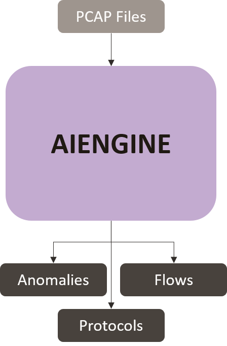

# AIEngine
### Next-Generation NIDS
###### *Installed Version: 1.9*


[AIEngine](https://bitbucket.org/camp0/aiengine) is a programmable network intrusion detection system with a wide range of classification and analysis functions, providing a powerful tool for professionals to identify and classify network traffic. AIEngine also claims to support easy integration with multiple databases (MySQL, Redis, Cassandra, Hadoop and more) as well as other packet engines such as Netfilter.

#### Features
+ Real-time programming to respond to threats without interrupting the service
+ Complex regex detection (PCRE JIT, Regex Graphs) & automatic regex generation for unknown traffic
+ Traffic frequency analysis
+ HTTP, DNS, SSL domain matching
+ Domain and host blacklists for HTTP, DNS, SMTP & SSL
+ TCP/UDP blacklists
+ Supports Set and Bloom filters for efficient IP searches
+ DDoS detection at network/application layer
+ Supports domain matching 
+ Yara signature generation 
+ Real-time network forensics
+ Network anomaly detection
+ Supports protocols such as Bitcoin, CoAP, DHCPv4/DHCPv6, DNS, DTLS, GPRS, GRE, HTTP, ICMPv4/ICMPv6, IMAP, IPv4/v6, Modbus, MPLS, MQTT, Netbios, NTP, OpenFlow, PPPoE, POP, Quic, RTP, SIP, SMB, SMTP, SSDP, SSH, SSL, TCP, UDP, VLAN, VXLAN. 

#### Input(s)
+ Network Interface
+ pcap file
+ directory of pcap files

#### Output(s)
The following is an excerpt of AIEngine's output when scanning the Kitsune Network Attack Dataset's "ARP MITM" pcap file. Note the following was outputted by the file adapter written for AIngine, discussed below in 'Contributions'.

```json
{
    "protocol_statistics": [
        {
            "protocol_name": "Ethernet",
            "cache_memory": "0 Bytes",
            "dynamic": "no",
            "memory": "952 Bytes",
            "packets": "2504267",
            "use_memory": "952 Bytes",
            "bytes": "479563670",
            "cache_miss": "0",
            "%_bytes": "100",
            "events": "0"
        }],
    "anomaly_statistics": {
        "Total IPv6 Loop ext headers": 0,
        "Total SSL bogus header": 0,
        "Total SMTP bogus header": 0,
        "Total IPv4 Fragmentation": 0,
        "Total DHCP bogus headers": 0,
        "Total RTP bogus headers": 0,
        "Total POP bogus header": 0,
        "Total IPv6 Fragmentation": 0,
        "Total SMTP long email": 0,
        "Total HTTP malformed URI": 82,
        "Total MQTT bogus headers": 0,
        "Total IMAP bogus header": 0,
        "Total HTTP no headers": 0,
        "Total DNS bogus header": 0,
        "Total Netbios bogus headers": 0,
        "Total TCP bogus header": 0,
        "Total SMB bogus headers": 0,
        "Total UDP bogus header": 2082091,
        "Total SNMP bogus header": 0,
        "Total TCP bad flags": 0,
        "Total DNS long domain name": 0,
        "Total CoAP bogus headers": 0
    },
    "flow_statistics": [
        {
            "info": "TCP:Flg[S(0)SA(0)A(4)F(0)R(0)P(1)Seq(16690613,3745726105)]",
            "bytes": "180",
            "flow": "[192.168.2.15:443]:6:[192.168.100.5:58961]",
            "packets": "4",
            "flow_forwarder": "TCPGenericProtocol"
        }]
}
```

#### Note(s)
+ full packet scans are also exported but are not included in the global JSON view generated by Protean
#### Contributions
###### aiengine_fileadapter.py
For AIEngine to export results to a file, a Python database adaptor was developed to facilitate the per-packet scan results. This database adaptor was then extended to convert specific information that AIEngine will only export to a terminal’s standard output, namely network flows, network anomalies and protocol statistics.

This was achieved by redirecting stdout to a file, then reading each line in the file and creating a JSON representation of the information. Explanations of how each information type is parsed can be found in the comments for the parse_protocol_summary(), parse_anomaly_summary() and parse_flows_summary() in aiengine_fileadapter.py. 
