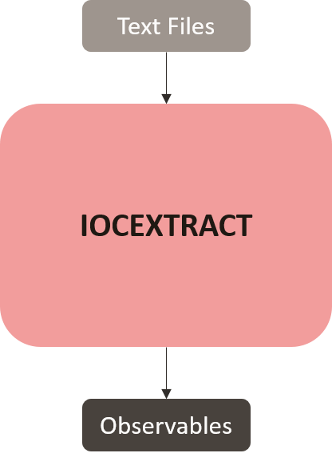

# Tool: iocextract
###### Purpose: Regex-based IOC Extraction from Text
###### Installed Version: 1.13.1


The [iocextract](https://github.com/InQuest/python-iocextract) Python library utilizes regular expressions and post processing on text bodies to extract Indictors of Compromise **optionally** refang them. The CLI version of iocextract also allows for the insertion of custom regex.


#### Input(s)
+ Text files parsable by Python

#### Output(s)
```json
{
    "email_addresses": [],
    "ipv4s": [],
    "ipv6s": [],
    "md5s": [],
    "sha1s": [],
    "sha256s": [],
    "sha512s": [],
    "urls": [],
    "yara-rules": [],
}

```

#### Note(s)
+ **signicantly faster than ioc-finder, unless the range of observables supported by ioc-finder is required - use iocextract**
+ Specifically designed to parse defanged IOCs, so has lower performance than a “fanged-only” extractor
+ Each indicator type requires a complete passover of the supplied text and returns an iterator.
+ Specifies IPv6 is only 'partially supported' - limited defanging recognition
+ cannot parse URLs without schemes
+ frequently parses invalid email addresses

#### Contributions
###### unit_tests.py
Suite of unit tests used to verify supported Indicator of Compromise types and defanging techniques

###### performance_tests.py
Uses pdfs in the APTNotes repository to test each extraction tool, recording elapsed time and the average time it takes a tool to finish extracting a file.

Program arguments:
- argv[1] maximum: sets the maximum amount of files to attempt extraction of
- argv[2] repetitions: repeat the test instance this amount of times

Note the logic of repeating tests was moved to inside of performance_tests.py as ```docker exec``` has considerable set-up time if repeatedly called.

###### test_analysis.py
Takes the results from performance_tests.py, counts the number of observables and calculates average metrics across test instances

###### extract_protean.py
Similar to performance_tests.py but for the tool’s use within Protean, uses documents from the /protean_input folder