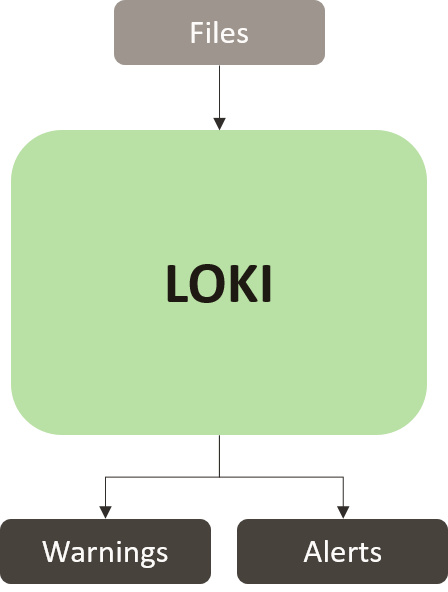

# Loki
### IOC Scanner
###### *Installed Version: 0.32.1*


[Loki](https://github.com/InQuest/python-iocextract) is an open-source Indicator of Compromise scanner that utilises four main methods to detect and report suspicious files and processes:

+ Perform a regular expression match on file path/name
+ Perform a Yara signature match on file data or process memory
+ Perform a comparison of scanned files against known malicious hashes (MD5, SHA1, SHA256)
+ Perform a comparison of process connection endpoints with known Command-and-Control (C2) IOCs

##### Feature Set
| Feature                           | Description   |
| --------------------------------- |---------------|
|   Custom File Hashes              | Detect malware or hack tools based on custom file hashes (SHA1, SHA256 & MD5) |
|   Custom Filename Characteristics | Detect malware or hack tools based on filename characteristics (regex) |
|   Custom Yara Rules               | Detect malware or hack tools based on YARA signatures (file & process memory scan). Furthermore, custom rules can be added. |
|   Custom Exclusion                | A configuration file can allow for specific drives, extensions or processes to be excluded from a scan via regular expression matching. |
|   Process Analysis                | Analysis of the current running processes for strange Hooks/File Handles/Mutex definitions, network connections, memory strings, working directories, and cloaking attempts |
|   Active Network Connections      | Analysis of all active network connections; users, process ids, end points, and port numbers |
|   File System Analysis            | Analysis of the file system with signatures to identify attacker’s tool sets, common backdoor modifications, hash or password dump files, cloaked executables and much more. |
|   System File Integrity Check     | Checks the integrity of the most common system files by using YARA rules |
|   Text Export                     | Plain text log file of all events reported by THOR. |
|   Syslog Export                   | Syslog export of the events generated by THOR. This export option is fully flexible. You can define different target ports, multiple target systems, use UDP or TCP and choose between different formats. |
|   Threat Intelligence Receivers   | By providing an API key to AlienVault OTX or MISP, subscribed events/iocs will be stored and added to the ruleset (if applicable) |

#### Input(s)
+ Path to start scanning from

#### Output(s)
+ Loki logs **Warnings** when a suspicious object is detected
+ Loki logs **Alerts** when an Indicator of Compromise is detected

To provide an example output, the following is an excerpt of Loki's output when performing a scan on its own IOC signature-base (thus causing positive alerts/warnings). Note that unless specified from command line, Loki will not scan its own directory. 

Links have been removed from the following output to avoid linking to unknown sites.

```json
{
    "meta": {
        "start_time": "20210129T05:35:12Z",
        "total_alerts": 84,
        "scan_path": "Loki-0.32.1",
        "total_warnings": 103,
        "total_bytes": 8745463,
        "total_files_scanned": 746,
        "end_time": "20210129T05:36:00Z"
    },
    "info": {
        "EXE": {
            "cumulative_bytes": 1542144,
            "total_type_scanned": 2
        },
        "UNKNOWN": {
            "cumulative_bytes": 7091364,
            "total_type_scanned": 732
        },
    },
    "alerts": {
        "Loki-0.32.1/signature-base/yara/apt_telebots.yar": {
            "warning_meta": {
                "accessed": "Thu Jan 28 05:42:02 2021",
                "filetype": "UNKNOWN",
                "size": "5815",
                "modified": "Thu Jan 28 05:41:59 2021",
                "created": "Thu Jan 28 05:41:59 2021"
            },
            "first_bytes": "2f2a0a202020596172612052756c65205365740a / /*   Yara Rule Set",
            "hashes": {
                "sha256": "c6e74e2b2bd8d4fc56520e98c9f599587948a538ee2c9ae588ee7aa7df9d31d5",
                "sha1": "4c5770c9e73fcc1d16bbcf5baf6a235cb600d4cd",
                "md5": "a04d0e307f9df5780b54ee28a28df6b6"
            },
            "score": "110",
            "reasons": [
                {
                    "subscore": "40",
                    "reason": "Yara Rule",
                    "ref": "Internal Research",
                    "description": "Certutil Decode",
                    "match": "Certutil_Decode_OR_Download"
                },
                {
                    "subscore": "70",
                    "reason": "Yara Rule",
                    "ref": "[Protean] Redacted URL",
                    "description": "Detects TeleBots malware - IntercepterNG",
                    "match": "TeleBots_IntercepterNG"
                }
            ]
        },
    },
    "warnings": {
        "Loki-0.32.1/signature-base/yara/apt_eternalblue_non_wannacry.yar": {
            "warning_meta": {
                "accessed": "Thu Jan 28 05:42:02 2021",
                "filetype": "UNKNOWN",
                "size": "2666",
                "modified": "Thu Jan 28 05:41:59 2021",
                "created": "Thu Jan 28 05:41:59 2021"
            },
            "first_bytes": "0a2f2a0a202020596172612052756c6520536574 / /*   Yara Rule Set",
            "hashes": {
                "sha256": "059e6cde633bb8b1fc77b49288b105df6b3f2e0f11872f59b2bcd43ac0fd24ad",
                "sha1": "f096e532df8b13b2f76a0c7440aa7073ebcdebc6",
                "md5": "bc067ac828bb7e27a688ed8408eb69d8"
            },
            "score": "70",
            "reasons": [
                {
                    "subscore": "70",
                    "reason": "Yara Rule",
                    "ref": "[Protean] Redacted URL",
                    "description": "Detects malware Redosdru - file systemHome.exe",
                    "match": "Backdoor_Redosdru_Jun17"
                }
            ]
        },
    },
}
```

#### Note(s)
+ when using the 'intense' flag, it was discovered that scanning the entire filesystem would cause Loki to crash and exit. Upon investigation, the /proc filesystem was found to cause this error as it is an *illusionary filesystem*. As a result, /proc was included in Loki's exclude file

#### Contributions
###### loki_json_plugin.py
To export scan results, Loki provides a CSV logging option - however this information is not well formatted (missing white spaces and some logs have inconsistent ordering). As the output of Protean is a global JSON view, a plugin was developed to convert the csv logs into a JSON representation.
For this plugin to work, Loki must be run with the following commands:

        -l ./loki_scan_log.csv --csv
As Loki does not provide the architecture to custom log data during a scan's execution, this plugin works by having Loki export its scans to a file (to a known path and filename) and then proceeds to convert the csv logs into a new JSON format.